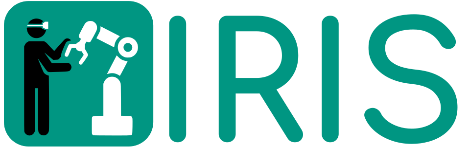
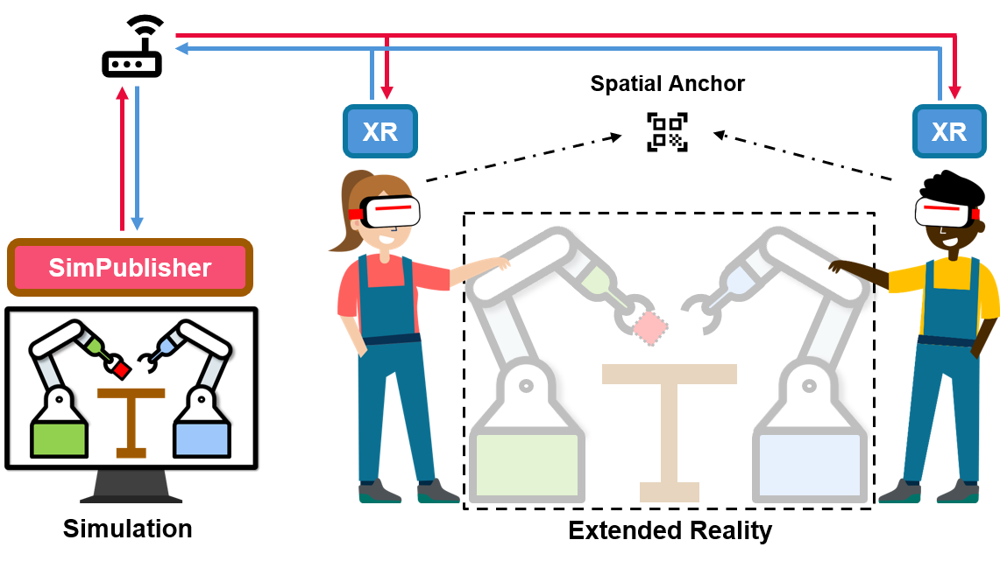
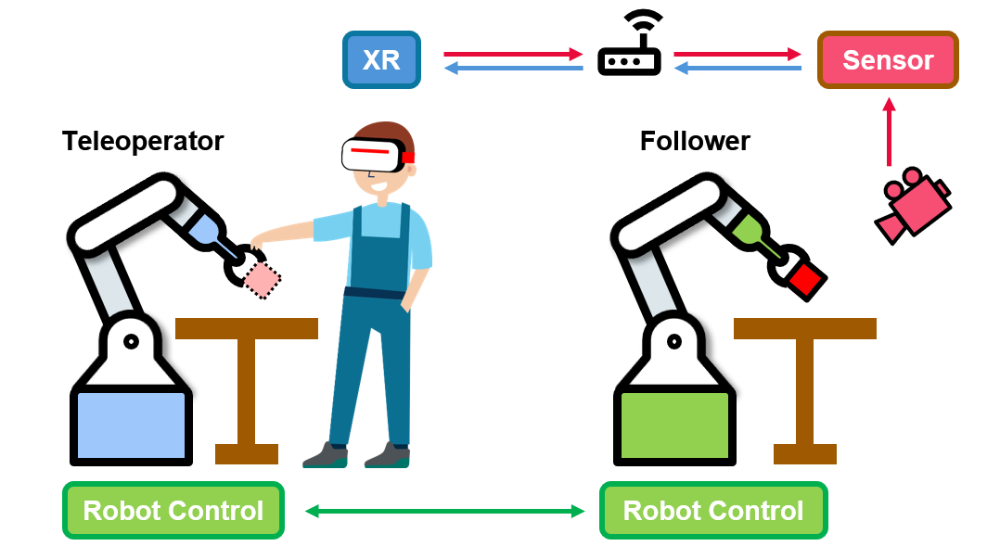

    

# IRIS: **I**mmersive **R**obot **I**nteraction **S**ystem

**I**mmersive **R**obot **I**nteraction **S**ystem (**IRIS**) is a flexible framework designed to support immersive Human-Robot Interaction through Extended Reality (XR).  

With IRIS, robot researchers no longer need to invest extensive effort in developing C# or Unity applications. Instead, IRIS streamlines the workflow and helps accelerate the research process.  

The framework provides:  
- An open-source Python library called **SimPublisher**  
- The **IRIS-Viz** package  
- XR applications for multiple platforms  

Using these components, researchers can **directly use Python code** in a seperate PC to display virtual objects in XR headsets and collect interaction data from XR devices.

## System Architecture

The IRIS system architecture supports interaction with robots in both **simulation** and the **real world**.
All devices are connected through a Wi-Fi router.

### Interact with Robots in Simulation
In the simulation paradigm, the scene is updated to all XR headsets through **SimPublisher**.  
A spatial anchor aligns the virtual scenes across different headsets, ensuring consistent shared environments.

    

### Interact with Robots in the Real World
In the real-world paradigm, a sensor generates a point cloud and transmits it to the XR headset.  
This allows the teleoperator to clearly observe the manipulated object in front of the follower robot.

    

## Features

**IRIS** is designed to generalize XR applications through five key features:

- **Cross-Scene**: unified representation of simulated objects for consistent scene rendering across simulators.
- **Cross-Embodiment**: compatibility with diverse robot configurations via modular modeling.
- **Cross-Simulator**: support for multiple simulators (e.g., MuJoCo, IsaacSim, CoppeliaSim, Genesis).
- **Cross-Reality**: integration across both simulated and real-world environments with data visualization tools.
- **Cross-Platform**: XR compatibility across different headsets, leveraging modular design for portability.
- **Cross-User**: multi-user collaboration and synchronized XR-based data collection.

