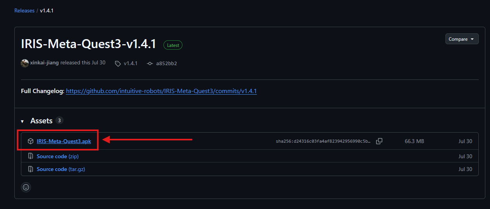
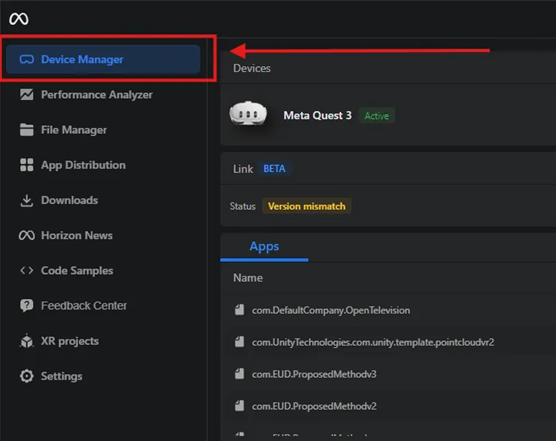
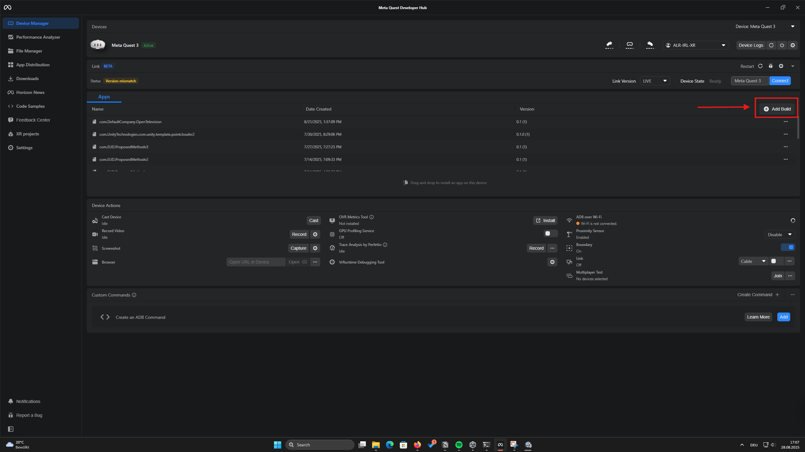

# Deploy on Meta Quest 3

The fastest way to experience IRIS on a Meta Quest 3 is to install the pre-built APK provided by the team. Follow the sections below to prepare your headset, download the build, and deploy it with Meta Quest Developer Hub (MQDH).

## Prerequisites

- Meta Quest Developer Hub installed on your workstation: [Download MQDH](https://developers.meta.com/horizon/downloads/package/oculus-developer-hub-win/).
- Meta Quest 3 with **Developer Mode** enabled and a USB-C cable for data transfer.
- Meta account with the headset paired so that MQDH can detect the device.

## 1. Download the IRIS build

1. Browse to the latest release on GitHub: [IRIS-Meta-Quest3](https://github.com/intuitive-robots/IRIS-Meta-Quest3).
2. Download the most recent `.apk` asset from the release page.

   

## 2. Connect the headset

1. Power on the Meta Quest 3 and connect it to your computer with the USB-C cable.
2. Put on the headset to confirm the **Allow data access** prompt so MQDH can communicate with the device.

## 3. Install the APK with MQDH (recommended)

1. Launch **Meta Quest Developer Hub** and open the **Device Manager** tab.

   

2. Click **Add Build**, choose the APK you downloaded, and confirm. MQDH will create a build entry.

   

3. In the build card that appears, select the connected headset and press **Install**. MQDH displays progress while sideloading the app.
4. Wait for the status to change to **Installed** before disconnecting the headset.

## 4. Verify the deployment

1. Put on the Meta Quest 3, open the **Apps** panel, and switch to the **Unknown Sources** filter.
2. Launch the IRIS application. The splash screen should appear within a few seconds.
3. Confirm network access and sign in if prompted.

## Troubleshooting

- **Device not detected**: Re-seat the USB cable, re-open MQDH, and confirm Developer Mode is enabled in the Meta Quest mobile app.
- **Install button disabled**: Ensure the headset is awake and unlocked while MQDH performs the sideload operation.
- **App missing under Unknown Sources**: Reboot the headset, then repeat the installation. MQDH logs appear in the bottom panel if additional detail is needed.
